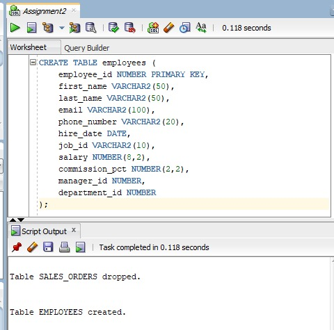
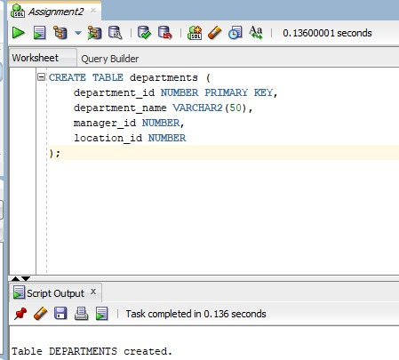
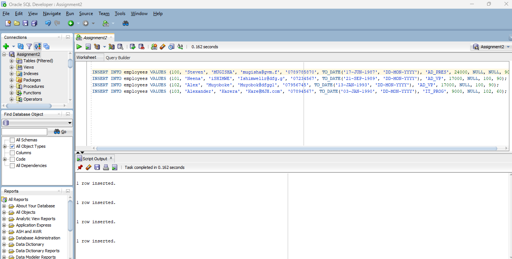
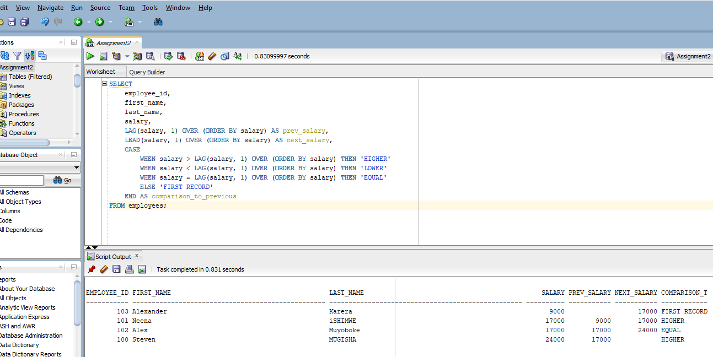
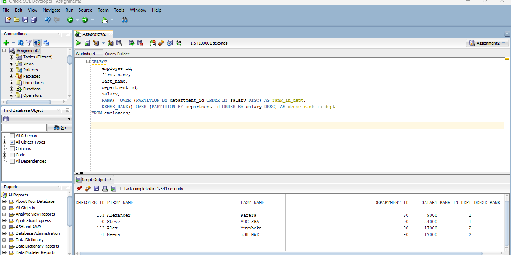
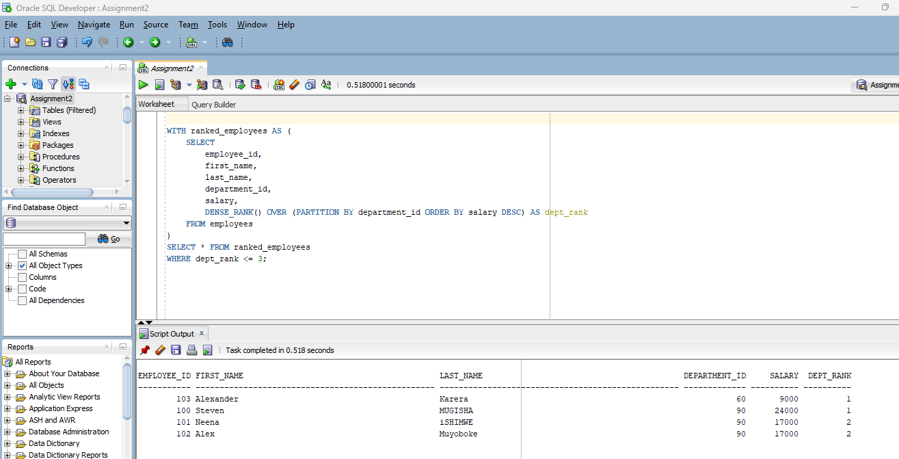
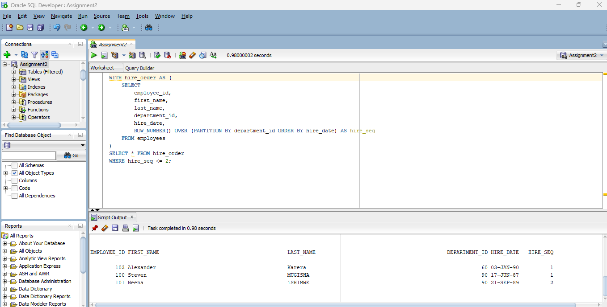
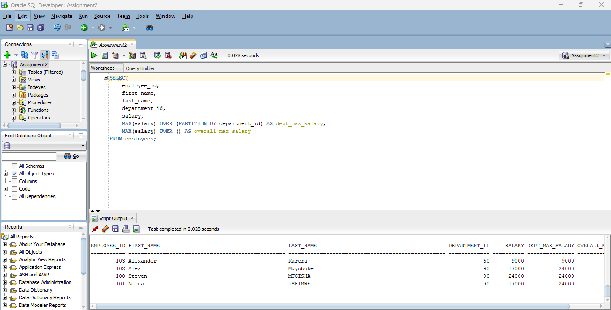

# SQL Window Functions Analysis Project

## Team Information
## Members:

### 1. MUSHIMIYUMUKIZA Blaise 26229 
### 2. AINEMBABAZI Eunice  25881

### Instructor: Eric Maniraquha

### Course: Database Development with PL/SQL (INSY 8311)

### Institution: Adventist University of Central Africa

## Project Overview
This project demonstrates the practical application of SQL window functions in Oracle PL/SQL. We've created a comprehensive database solution that includes table creation, sample data insertion, and several analytical procedures that leverage window functions to solve common business problems related to employee salary analysis.

# Database Schema
Our database consists of two main tables:

1. employees Table
Stores employee information including:

Employee ID, name, contact details

Hire date, job ID, salary

Department and manager relationships
## Screenshoot

2. departments Table
Contains department details:

Department ID and name

Manager and location information

Procedures Implemented
#### 1. generate_salary_comparison_report
Purpose: Compares each employee's salary with their department peers
Window Functions Used:

LAG() - Accesses previous row's salary

LEAD() - Accesses next row's salary

Business Value: Helps identify salary progression patterns within departments.

#### 2. generate_department_ranking_report
Purpose: Ranks departments by average salary
Window Functions Used:

1.RANK() - Standard ranking with gaps

2.DENSE_RANK() - Ranking without gaps

Business Value: Provides insights into which departments are most/least compensated. 

#### 3. generate_top_earners_report
Purpose: Identifies top N earners in each department
Window Function Used:

DENSE_RANK() - For ranking within partitions

Business Value: Helps with retention strategies for high performers

4. generate_salary_distribution
Purpose: Analyzes salary distribution across the organization
Window Functions Used:

MAX() OVER (PARTITION BY) - Department-level maximums

MAX() OVER () - Organization-wide maximum

Business Value: Reveals compensation equity across the company

## Real-World Applications 
#### HR Analytics: These procedures provide valuable insights for human resources departments to:
<ol>
  <li>Identify compensation trends</li>

<li>Spot potential salary inequities</li>

<li>Make data-driven decisions about raises and promotions</li>
</ol>

#### Financial Planning: The reports help finance teams:
<ol>

<li>Forecast payroll expenses</li>

<li>Allocate budgets by department</li>

<li>Plan for merit increases</li>
</ol>

#### Employee Development: Managers can use this data to:
<ol>
<li>Understand their team's compensation relative to others</li>

<li>Develop retention strategies for top performers</li>

<li>Create career progression plans</li>
</ol>

# Key Learnings
Through this project, we've gained practical experience with:

### Window Function Concepts:

-Partitioning data with PARTITION BY

-Ordering within windows with ORDER BY

-Frame specification for sliding windows

### Specific Functions:

-Ranking functions (RANK, DENSE_RANK, ROW_NUMBER)

-Offset functions (LAG, LEAD)

-Aggregate functions in window context

-Performance Considerations:

-The efficiency benefits of window functions over self-joins

-The impact of partitioning on query performance

-Memory usage with large window frames

## Future Enhancements
-Add more comprehensive error handling

-Incorporate additional window functions like FIRST_VALUE and LAST_VALUE

-Create visualization procedures to generate HTML reports

-Add historical tracking for salary changes over time

